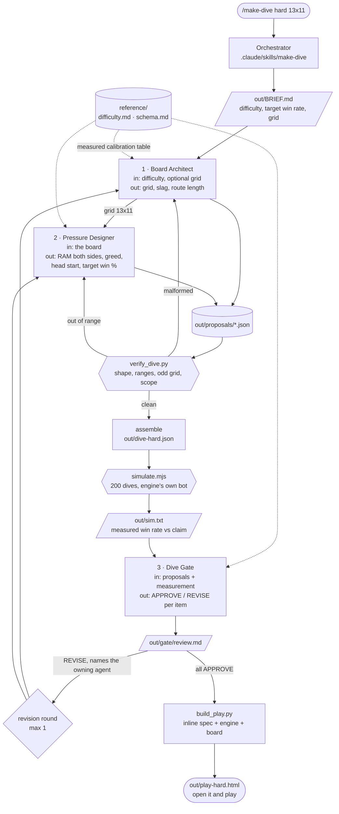

# Architecture

Three agents, one measured reference table, one deterministic verifier, one
simulator that plays the dive 200 times, and a build step that turns the
result into a page you can open.

## Diagram

## Why the data flows this way

**Board Architect first.** Every pressure number means something different on a
different grid. `oppRam` 5 is a fair fight on 13x11 and a rout on 9x7, because
the smaller board gives SIG-0 a shorter route to shorten further. The Pressure
Designer cannot size its numbers without knowing the board, so the board is
decided first and handed down explicitly.

**Simulator before the gate.** The gate's most useful question is "does the
measurement match the claim?", and it cannot ask that until something has
measured. Running the simulator first means the gate reviews a dive that has
already been played 200 times rather than one that only looks reasonable.

**Gate last, over everything.** A per-agent gate would miss the failure that
matters most here: two agents each making a defensible choice that combine into
a dive decided at board generation. A high `headStart` is fine. A high `oppRam`
is fine. Together they are frequently not a difficulty setting at all.

## Three kinds of checking

They are deliberately different mechanisms.

| | `verify_dive.py` | `simulate.mjs` | Dive Gate |
|---|---|---|---|
| asks | is it well formed? | is it a contest? | is it worth playing? |
| kind | stdlib Python, instant | the real engine, 200 dives | an agent with judgment |
| catches | out-of-range knobs, even grid dimensions, missing rationale, out-of-scope keys | unwinnable dives, uncontested dives, claims more than 15 points off | double-counted levers, a dive over in two rounds, a claim the board never supported |
| verdict | exit 0 / exit 1 with the problem named | exit 0 / exit 1 with the measured number | APPROVE, REVISE citing a number, or advisory NOTE |
| arguable | no | no | only with a citation |

Mechanical rules live in the script, where they are instant and cannot be
talked out of a verdict. Empirical questions go to the simulator, which settles
them by playing the game rather than reasoning about it. Judgment goes to the
agent, constrained by having to cite one of the other two.

The scope check is in the Python because it is the rule most likely to erode.
A dive is a grid, RAM and turns; a proposal carrying `augments` or `dominant`
is reaching for a different game, and that is caught structurally rather than
left to review.

A fourth check guards the engine itself. `node tools/check_bare.mjs` asserts
that the program layer is absent rather than disabled, statically and by
playing 300 dives and watching what they emit. It exists because the first
version of this repo tried to disable the program layer by configuration and
shipped an intrusion that cast REDIRECT in 49 of 60 dives.

## Failure paths

Nothing here fails silently.

- **Malformed proposal** — the staged verifier catches it before the next agent
  reads garbage. The owning agent re-runs with the exact error text.
- **Out-of-range knob** — same, with the workable range named. `slag` above
  0.25 is the common one: the board generator starts failing to find a fair
  layout at all.
- **Unwinnable or uncontested dive** — the simulator exits non-zero. These are
  the only two outcomes it refuses outright, because neither is a difficulty
  setting.
- **Claim far from measurement** — the simulator reports the drift and the gate
  assigns it to the Pressure Designer, which is always the agent that made the
  prediction. The board is never at fault for a bad claim about it.
- **Still contested after one revision round** — the dive ships with the
  objection recorded in the run report. It is never quietly dropped.
- **`node` unavailable** — the run continues and the report says the dive
  shipped unmeasured, rather than pretending a number exists.

## The playable page

`build_play.py` inlines four things into `play/shell.html`: the dive spec, the
58 KB engine bundle, the board stylesheet, and the renderer. The result is one
file with no external references at all.

That constraint is not tidiness. A browser refuses to load ES modules or fetch
JSON over `file://`, so anything left external would mean needing a web server.
Inlining is what makes `open out/play-hard.html` work by double-clicking, which
is the whole point of the deliverable.

The renderer is about 300 lines of plain DOM code. It draws `DuelState` as SVG
and sends exactly two things back to the engine: `rotate` with a cell index,
and `endTurn`. Everything else, including the flood, the cascade, the claim
ordering and SIG-0's entire turn, happens inside the vendored engine. The
opponent steps on a 260 ms timer rather than resolving instantly, so a cascade
is something you watch happen instead of something you find already done.
