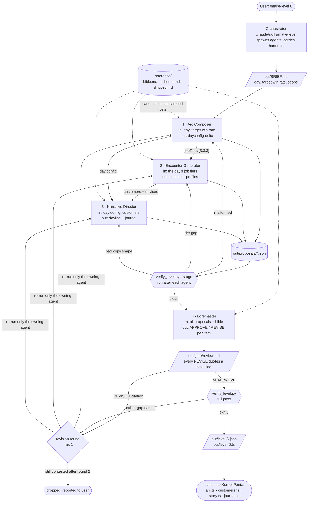

# Architecture

Four agents, one shared reference set, one deterministic verifier, one gate
with a revision loop.

## Diagram

## Why the data flows this way

The pipeline is sequential because each agent's output is literally the next
one's input, not because sequencing is tidy.

**Arc Composer first.** Its `jobTiers` array is the only thing that tells the
Encounter Generator what to build. Three tiers means three tickets, and each
distinct tier needs somebody who works at it. Run the Encounter Generator first
and it is inventing customers for a day that does not exist yet.

**Encounter Generator second.** The Narrative Director's day line is supposed
to notice what walks in the door. It cannot do that before anybody walks in.

**Narrative Director third.** It reads both prior outputs: the numbers tell it
what the day feels like mechanically, the customers tell it who the day is
about. Its output is the only thing here the player reads as authored prose
rather than as a fight.

**Loremaster last, over everything.** A gate that ran per-agent would miss the
things that are only wrong in combination: two customers with the same verbal
tic, a day line that promises a tone the roster does not deliver.

## The two kinds of checking

They are deliberately different mechanisms, and the split is the point.

| | `verify_level.py` | Loremaster |
|---|---|---|
| asks | can the game load this? | is this true? |
| kind | deterministic Python | an agent with judgment |
| catches | tier coverage gaps, illegal mode strings, out-of-range values, em dashes, malformed envelopes | canon contradictions, reveals ahead of schedule, duplicated devices, voice drift |
| verdict | exit 0 or exit 1 with the gap named | APPROVE, REVISE with a quoted line, or NOTE |
| can be argued with | no | it must cite the bible, or it may only advise |

Mechanical rules go in the script, where they are cheap, instant, and cannot be
talked out of a verdict. Judgment goes to the agent, which is constrained by
having to quote its source. A REVISE that cannot cite a bible line is
downgraded to an advisory NOTE, which keeps the gate from becoming an
unfalsifiable second opinion.

## Failure paths

Nothing in this pipeline fails silently.

- **Malformed proposal** — the staged verifier catches it before the next agent
  wastes a turn reading garbage. The owning agent is re-run with the exact
  error text.
- **Tier coverage gap** — caught at stage 2. This is the one that would crash
  the real game at ticket generation, so it is checked mechanically rather than
  left to review.
- **Canon break** — caught at the gate, sent back to exactly one agent with the
  citation, re-gated once.
- **Still contested after one revision round** — the item is dropped from the
  level and named in the run summary. It is never integrated quietly.
- **Verifier fails after the gate** — the run stops. The orchestrator is
  explicitly forbidden from hand-editing a proposal to make the verifier pass,
  because at that point the output would no longer be the crew's.
