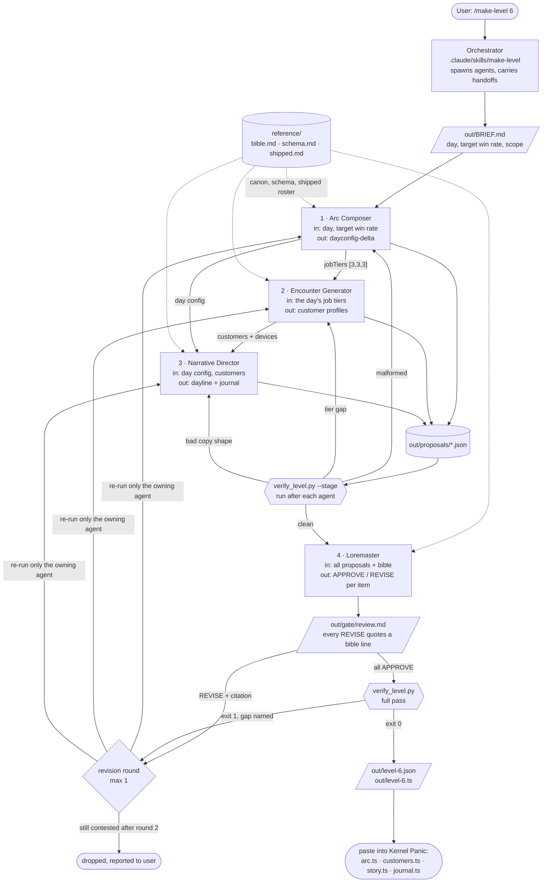

# Level Crew — an agent crew that builds levels for *Kernel Panic*

**Game: Kernel Panic.** A cyberpunk roguelike about inheriting your father's
computer repair shop. Every repair ticket is an intrusion: something alive is
inside a customer's machine, and fixing it means diving in and fighting it on a
grid of pipe junctions, racing it to the core. You get ten days per run. Nine
working days of three tickets each, then the padlocked back room settles up.

**What this crew produces: one complete working day.** In *Kernel Panic* the
day is the unit of level design. Building one means producing four things that
have to agree with each other:

1. the day's **difficulty configuration** — grid size, the intrusion's RAM
   pool, how greedily it pushes for the core, how deep it already sits when you
   link in, and the difficulty tier of each of the three tickets
2. the **customers** whose tickets fill those tiers — a person, a haunted
   device, the intrusion's dominant mode, and the lines they say at the counter
   before and after you dive
3. the **day line** that opens the day on the terminal
4. a **DAD.LOG journal entry** unlocked around that point in the run

Four agents produce those four things in sequence, a fifth pass gates them for
canon, and a deterministic script verifies the result against the invariants
the real game enforces. Output lands as `out/level-<n>.json` and
`out/level-<n>.ts`, the latter formatted to paste straight into the game's
`arc.ts`, `customers.ts`, `story.ts` and `journal.ts`.

This directory is a deliberately narrow slice of a larger nine-agent crew that
produces all content for the game. That crew depends on paid image-generation
connectors, so this submission is cut down to the level-authoring lane and runs
on Claude alone: core file tools, no MCP servers, no API key, no install step.

---

## Running it

Requires Claude Code. Nothing else — no `pip install`, no `ANTHROPIC_API_KEY`,
no network services.

```bash
cd level-crew
claude
```

then, in the session:

```
/make-level 6
```

Any day from 1 to 9. Day 10 is the game's scripted finale and is out of scope.

Headless, if you would rather not sit in the session:

```bash
cd level-crew
claude -p "/make-level 6" --permission-mode acceptEdits
```

A completed example run is committed under `out/`, so you can read the output
without spending tokens.

---

## Architecture



`ARCHITECTURE.md` has the same diagram plus notes on why the data flows in this
order and how the two kinds of checking differ.

---

## The four agents

Each one's output is the next one's input. None can be removed without the
pipeline breaking, and the table's last column says exactly how.

### 1. Arc Composer — `level-arc-composer`

**In:** the day number and its target win rate.
**Out:** one `dayconfig-delta` item — `grid`, `oppRam`, `greed`, `abilityFreq`,
`minCost`, `minPd`, `headStart`, `parFlat`, `slag`, `patchDrop`, `jobTiers`.

The entire difficulty design of *Kernel Panic* is one table, and this agent
writes one row of it. It positions the day against its neighbours in the
shipped curve and argues its numbers against a target win rate rather than
picking them by feel.

**Remove it and:** there is no day. There is also no `jobTiers` array, which is
the only input the Encounter Generator has.

### 2. Encounter Generator — `level-encounter-generator`

**In:** the `jobTiers` array from the Arc Composer's proposal.
**Out:** `customer` items — name, device, portrait, two intake quotes, a win
line, a loss line, the tiers they appear at, and the intrusion's dominant mode.

Each customer is a person with one strange, concrete, slightly wrong object,
and an intrusion whose behaviour matches the object's personality. A possessive
heirloom locks. A hungry kiosk siphons. The dominant mode is one of exactly
six, because the game's Analyze screen has a tell for six and no more.

**Remove it and:** the day has three tickets with nobody attached to them. Tier
coverage is an engine invariant, not a nicety — a day asking for a tier 4
ticket with no tier 4 customer fails at ticket generation.

### 3. Narrative Director — `level-narrative-director`

**In:** the day config and the customer list.
**Out:** one `dayline` item and one `journal` item.

The day line is the single authored sentence between the player and three hours
of grid combat. It reads the mechanics as subtext: if the Arc Composer raised
head start, the intrusion is inside before you sit down, and the line can say
so without ever saying "head start". The journal entry is DAD.LOG, the player's
own log, and it is bound by a reveal schedule — it may notice the back room but
never explain it.

**Remove it and:** the day never opens. The engine asserts at least nine day
lines exist; a day without one has no way to present itself.

### 4. Loremaster — `level-loremaster`

**In:** all three proposals plus the setting bible.
**Out:** `out/gate/review.md` — APPROVE, REVISE or NOTE for every item, plus a
tally.

The canon gate. It asks one question of every item: is it true? True to the
world, true to the voice, true to what the player is allowed to know at that
point in the story. **Every REVISE must quote the bible line it rests on.** If
it cannot find a line to quote, it may not block; the verdict downgrades to an
advisory NOTE. That rule is what keeps the gate from being an unfalsifiable
second opinion with veto power.

**Remove it and:** nothing checks whether a customer just revealed the plot,
whether a device duplicates a shipped regular, or whether the day line broke
voice. The mechanical verifier cannot catch any of those.

### The revision loop

A REVISE does not end the run. The orchestrator re-spawns **only** the agent
that owns the flagged item, hands it the objection and the quoted bible line,
and tells it to revise those items and leave everything else untouched. Then it
re-gates. One round; anything still contested is dropped from the level and
reported rather than integrated quietly.

---

## The verifier

`tools/verify_level.py` is standard-library Python with no dependencies. It
encodes the invariants the real game enforces, so a level that passes here is
one the game can actually load:

- **tier coverage** — every tier in `jobTiers` has a customer who works at it
- **legal dominant modes** — one of `redirect`, `armHalt`, `armSiphon`,
  `purge`, `lock`, `ward`, and nothing else
- **the dash law** — no em dash or en dash in any string the player reads, a
  hard style rule of the game's voice
- **value ranges** — `greed`, `abilityFreq`, `slag`, `patchDrop` in 0..1; job
  tiers on the 1-5 scale and not the 1-3 program-tier scale, which is a
  different vocabulary in this game; grid dimensions odd
- **envelope shape** — every proposal has an agent, a brief, and items with ids
  and types
- **the day opens** — exactly one day line, beginning `DAY N.`

It runs after each agent as a staged check and once more over the whole level
after the gate. It collects every problem rather than dying on the first, so a
single run tells an agent everything it has to fix.

The orchestrator is explicitly forbidden from hand-editing a proposal to make
the verifier pass. If the output is patched by hand it is no longer the crew's
output.

A fixture with fourteen deliberate defects lives in `tests/broken-fixture/`:

```bash
python3 tools/verify_level.py --day 6 --dir tests/broken-fixture
```

It should exit 1 and name all fourteen.

---

## The committed example run: `/make-level 6`

Everything under `out/` is a real run, not a mock-up. Day 6 sits at the flat
centre of the curve, target win rate 56 percent.

**What each agent produced**

| agent | output |
|---|---|
| Arc Composer | `jobTiers [3, 3, 3]`, grid 11x9, `oppRam` 7, `greed` 0.98, `headStart` 2 |
| Encounter Generator | Talia Vance / Aqualume reef tank controller / `redirect`; Emmett Cho / Feedrail busking amp rig / `armSiphon`; Priya Osei / Loomgate embroidery frame / `purge` |
| Narrative Director | `"DAY 6. Three tickets, same weight today. No easy one to start on."` plus a journal entry, THREE STUBS, SAME PRICE |
| Loremaster | 6 seen, 6 approved, 0 revised, 0 noted |

**The handoffs are visible in the outputs.** The Arc Composer chose
`jobTiers [3,3,3]` and called it "the one deliberate flat spot... a wall of
same-weight work before day 7 introduces its first tier-4 spike." The Encounter
Generator, reading only that array, gave all three customers overlapping tier-3
coverage and deliberately spread their dominant modes so "day 6 does not read
as one fight three times even though every ticket sits at the same tier." The
Narrative Director then wrote a day line about exactly that flatness, and a
journal entry about three ticket stubs priced identically. None of those agents
saw the others' reasoning, only their JSON.

**The gate returned clean on this run.** Six APPROVE verdicts, so the revision
round never fired. The loop is implemented and documented, but the committed
run does not exercise it. What the run does show is the gate citing canon to
justify each approval, including the bible line it checked each customer
against.

**A note on the numbers.** The Arc Composer's day 6 config reproduces the
shipped `DAY_CONFIGS` row value for value, having derived it from the
neighbouring days rather than copied it. That is a convergence check rather
than new balance work: this run's genuinely new content is the three customers,
the day line, and the journal entry. Asking for different numbers means giving
the brief a different target win rate.

**Verifier result:**

```
verify_level.py: level in out/proposals/
  . tier coverage: jobTiers [3, 3, 3] all covered by 3 customers
  . dominant spread: armSiphon x1, purge x1, redirect x1
  OK. 2 note(s), 0 problems.
```

---

## Layout

```
level-crew/
  README.md                     this file
  ARCHITECTURE.md               diagram, data-flow rationale, failure paths
  CLAUDE.md                     orients the orchestrator session
  .claude/
    settings.json               lets the verifier run without a prompt
    agents/                     the four agent definitions
      level-arc-composer.md
      level-encounter-generator.md
      level-narrative-director.md
      level-loremaster.md
    skills/make-level/SKILL.md  the orchestration program behind /make-level
  reference/
    bible.md                    canon: world, tech rules, shop, cast, voice
    schema.md                   item shapes, engine invariants, the tier trap
    shipped.md                  the 9-day curve, 12 shipped customers, 9 day lines
  tools/verify_level.py         deterministic validator, stdlib only
  tests/broken-fixture/         14 seeded defects, for checking the verifier
  out/                          a completed run: brief, proposals, gate, level
```

Everything the agents need is in `reference/`. Nothing in this directory reads
or writes outside it, so it runs standalone.

---

## Design notes

**Why the agents cannot write to the game.** In the parent project the rule is
that agents propose structured JSON and a single orchestrator integrates it by
hand, with a typechecker as the schema enforcer. Nine agents editing a live
TypeScript codebase in parallel produces merge damage and silent breakage. The
same rule holds here in miniature: agents write JSON to `out/`, and the
assembled `.ts` file is something a human pastes.

**Why two kinds of checking.** Mechanical rules — coverage, ranges, legal
enum strings, the dash law — belong in a script, where they are instant, free,
and cannot be argued with. Judgment — canon, voice, whether a line reveals too
much — belongs to an agent, constrained by having to quote its source. Putting
canon in the script would make it brittle; putting coverage in the gate would
make it unreliable.

**Why the reference set is a snapshot.** The agents read `reference/`, not the
game repository. That makes this directory portable and makes every run
reproducible against a fixed canon, at the cost of needing a refresh when the
game's shipped content moves.

**What was cut.** The full crew also runs an ability designer, a UX and sound
agent, an art director backed by an image generation service, a teaching-
coverage gate that asks "does the player know what this is?", and a validation
agent that runs the game's simulation harnesses over 200 seeds. None of that is
here. This is the level lane only.
