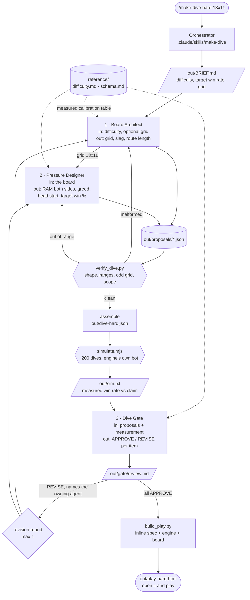

# Dive Crew — an agent crew that builds playable levels for *Kernel Panic*

**Game: Kernel Panic.** A cyberpunk roguelike about inheriting your father's
computer repair shop. Every repair ticket is an intrusion: something alive is
inside a customer's machine, and clearing it means diving into the device and
racing it to the core.

**What this crew produces: one dive, playable in your browser.**

A dive is a grid of scrambled pipe junctions. Your port sits on one side,
SIG-0's on the other, the core in the middle. Rotating a junction is the only
move you have and it costs 1 RAM. When arms line up, your signal floods
through them and claims every neutral node it reaches, so one good rotation
can cascade a whole chain at once. Claimed ground is permanent and the enemy
signal can never cross it. First flood to touch the core wins.

That is the entire game here. **A grid, RAM, and turns.**

Three agents design one, a simulator measures it, a gate judges it, and the
run ends with a single HTML file you open and play.

```
python3 tools/build_play.py out/dive-hard.json
open out/play-hard.html
```

No server. No install. No API key. The page has the dive spec, the game engine
and the board styling inlined into it, so it opens by double-clicking.

---

## Running it

Requires Claude Code. `node` is used to simulate the dive and `bun` only if you
change the engine; both are optional for opening a dive that already exists.

```bash
cd kernel-panic-level-crew
claude
```

then, in the session:

```
/make-dive hard
/make-dive normal 9x7
/make-dive 45%
```

Difficulty is `easy`, `normal`, `hard`, `brutal`, or a bare target percentage.
The optional second argument pins the grid; both dimensions must be odd.

Headless:

```bash
claude -p "/make-dive hard 13x11" --permission-mode acceptEdits
```

A completed run is committed under `out/`, so you can open a dive and play it
without spending a token.

---

## Architecture



---

## The three agents

Each one's output is the next one's input.

### 1. Board Architect — `board-architect`

**In:** the requested difficulty, and an explicit grid if you gave one.
**Out:** `grid`, `slag`, `minCost`, `minPd`, `parFlat`.

Shapes the maze. Grid size is the dive's silhouette; slag density is what
carves an open field into corridors so the choice of direction matters;
`minCost` is the route length the generator aims at. It argues its shape
against the measured calibration table rather than picking numbers by feel.

**Remove it and:** there is no board, and the Pressure Designer has no grid to
size its numbers against.

### 2. Pressure Designer — `pressure-designer`

**In:** the Board Architect's grid.
**Out:** `playerRam`, `oppRam`, `greed`, `headStart`, and a `targetWinPct`.

Decides the race. `oppRam` is the strongest lever, worth 10 to 20 points of win
rate per point. `headStart` is second and compounds with it, because ground
SIG-0 already holds also shortens its route. Then it commits to a number, which
the simulator immediately checks.

**Remove it and:** there is a board with no contest on it.

### 3. Dive Gate — `dive-gate`

**In:** both proposals plus the simulator's measured numbers.
**Out:** `out/gate/review.md`, APPROVE / REVISE / NOTE per item.

Asks whether this is a dive worth playing, which neither the schema check nor
the win rate can answer alone. Is the claim near the measurement? Is the dive
a contest rather than decided at generation? Are `headStart` and `oppRam`
double-counting the same pressure? Every REVISE must cite a measured number or
a line from the calibration table, and must name the agent that owns the fix.
A verdict it cannot support drops to an advisory NOTE.

**Remove it and:** a dive that measures 20 points off its claim ships anyway.

---

## Four kinds of checking

| | `check_bare.mjs` | `verify_dive.py` | `simulate.mjs` | Dive Gate |
|---|---|---|---|---|
| asks | is the engine still bare? | is the spec well formed? | is it a contest? | is it worth playing? |
| kind | static grep + 300 played dives | stdlib Python | the engine, 200 dives | an agent with judgment |
| catches | any program, trap or cast code reaching back into `engine/` | out-of-range knobs, even grid dimensions, out-of-scope keys | unwinnable, uncontested, or off-target dives | double-counted levers, a bad claim, a dive over in two rounds |
| verdict | exit 0 / exit 1 naming the file and line | exit 0 / exit 1 | exit 0 / exit 1 with the measured number | APPROVE, REVISE citing a number, or NOTE |

`simulate.mjs` plays the dive with `botPlayTurn`, the engine's own
route-following bot, at greed 0.95. Every row of `reference/difficulty.md` was
measured the same way, so the agents argue from numbers this repo can
reproduce on demand rather than from intuition.

`check_bare.mjs` runs first, before any agent is spawned. A dive authored on an
engine that can cast is not a dive, so the run stops there.

---

## The engine has nothing but the grid

`engine/` is the shipped game's duel engine with everything that is not a
rotation race **deleted**: no programs, no modes, no traps, no locks, no wards,
no augments, no patch pieces, no program tiers. 2836 lines became 1394. What
remains is board generation, flood and claim, cascade resolution, the
rotation-cost router, and the opponent's route planner. No external
dependencies, so it bundles to 26 KB of plain JavaScript.

That deletion is the design, and it was learned the hard way. The first version
vendored the engine whole and switched the program layer off by configuration:
`abilityFreq: 0`. That looked right and was not. `abilityFreq` gates only one of
five cast rules in the opponent's planner, so the intrusion cast REDIRECT in 49
of 60 dives. Configuration was never going to hold, because the capability was
still sitting in the codebase waiting for a mistake.

So there is no cast path left to misconfigure, and `tools/check_bare.mjs` keeps
it that way. The board's SVG rendering and every `kp-d*` style still come from
the shipped game, so a generated dive looks like the real board rather than a
mock of it.

Rebuild the browser bundle after any engine change:

```bash
bun build engine/browser-entry.ts --outfile=play/engine.bundle.js \
  --format=iife --target=browser
```

---

## The committed run: `/make-dive hard 13x11`

Everything under `out/` is a real run against the bare engine.

| knob | value | owner |
|---|---|---|
| grid | 13x11 | board-architect |
| slag | 0.18 | board-architect |
| minCost / minPd | 26 / 8 | board-architect |
| playerRam | 5 | pressure-designer |
| oppRam | 7 | pressure-designer |
| greed | 0.85 | pressure-designer |
| headStart | 2 | pressure-designer |

**Claimed 32%. Measured 31.5%** over 200 seeds, a drift of half a point,
centred in the 28-40% band `hard` asks for. Average rounds 2.3. Endings: core
196, gridlock 2, severed 2.

Both items approved. The gate did catch the Board Architect overstating its own
source, claiming 13x11 runs "2.9-3.1 rounds regardless of pressure" when the
row actually chosen measures 2.3, and said so without failing the item, since
the grid was mandated by the invocation rather than chosen.

Play it:

```bash
open out/play-hard.html
```

---

## Layout

```
kernel-panic-level-crew/
  README.md                     this file
  ARCHITECTURE.md               diagram, data flow, failure paths
  CLAUDE.md                     orients the orchestrator session
  .claude/
    settings.json               lets the three tools run without a prompt
    agents/                     board-architect, pressure-designer, dive-gate
    skills/make-dive/SKILL.md   the orchestration program behind /make-dive
  reference/
    difficulty.md               measured calibration table and what each knob does
    schema.md                   proposal shapes and the assembled dive
  engine/                       the game's duel engine, vendored
  play/
    engine.bundle.js            prebuilt browser bundle, committed
    play.css                    board styles, lifted from the shipped game
    play.js                     board renderer and turn loop
    shell.html                  page template the build fills in
  tools/
    verify_dive.py              structure and ranges
    simulate.mjs                200 dives, measured win rate
    build_play.py               inlines everything into one openable file
  out/                          a completed run, including a playable dive
```

---

## Roadmap

The dive is the floor of the game: every other system in *Kernel Panic* sits on
top of a rotation race, so it is the piece worth getting right first.

- **Programs.** The full game has SCAN, ATTACK and DEFEND with six modes
  between them. Adding them back here means deliberately porting that code in
  from the game and widening `check_bare.mjs`'s allowed vocabulary, which is a
  decision someone has to make on purpose. That is the point of having deleted
  it rather than disabled it.
- **Loadout.** Eighteen augments exist in the full game. A loadout agent
  choosing the player's answer to a given intrusion is the natural fourth seat,
  once programs are back.
- **Tuning loop.** The simulator currently reports and the gate assigns blame.
  Feeding the measured number straight back to the Pressure Designer and
  re-running until it converges makes the target self-correcting.
- **Boards worth remembering.** `minCost` and `slag` produce texture by
  accident. An agent that reads a generated board and judges whether it is
  interesting, rather than merely fair, would close the last gap between a
  correct dive and a good one.
